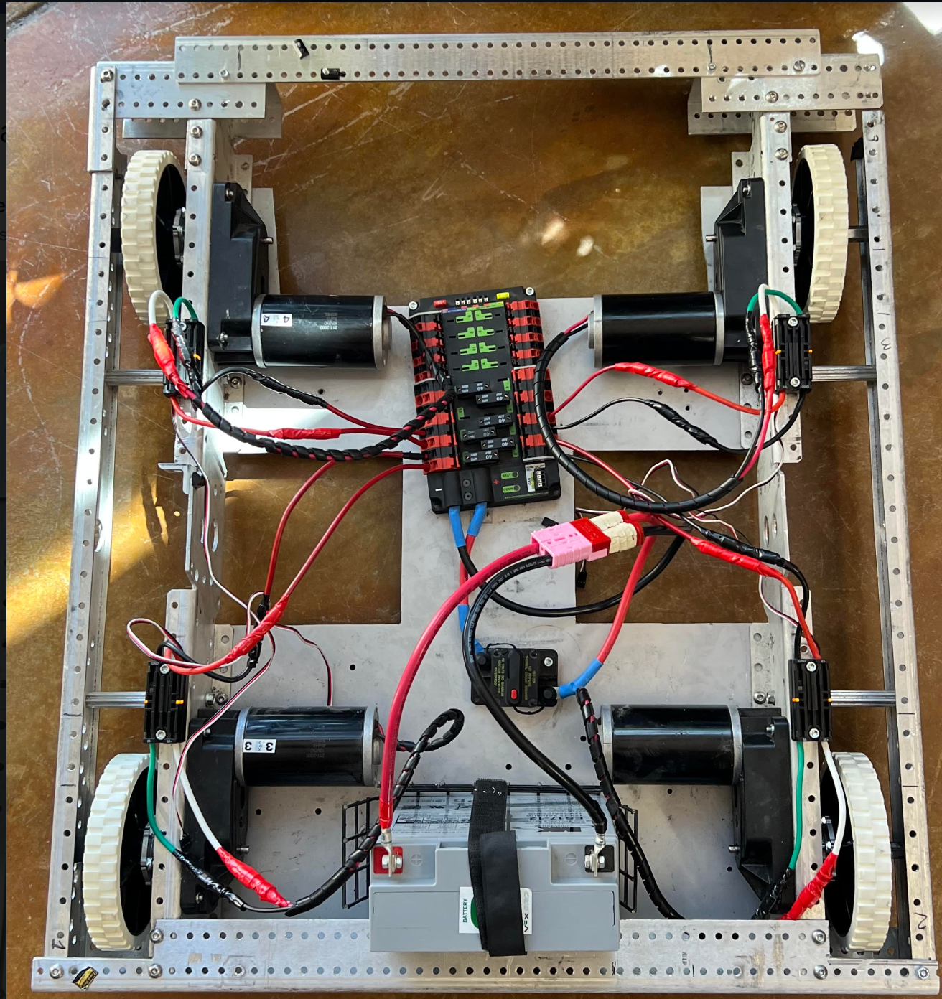
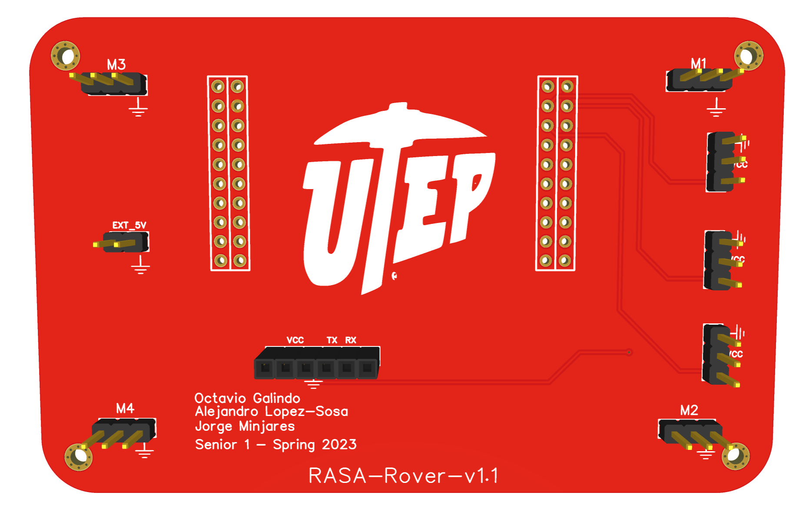

# Rover For Automated Soil Acquisition (RASA) :zap:
## **Objective** 
The objective of this project is to automate soil information acquisition. The rover is designed to maneuver between crop field lines and probe the soil with senosrs to acquire desired information. Once the system process the information it is sent over to the GUI and presented to the user. 
## **Team Members**
- Octavio Galindo
  - Graphical User Interface (GUI)
- Alejandro Lopez-Sosa
  - Power Distribution
  - Co-design Hardware
- Jorge Minjares
  - Firmware Development
  - Co-design Hardware
## **Requirements**
  - [x] Robotic Arm 
    - [x] Servo Motors (SG90)
  - [x] Remote Controlled
    - [x] RP2040 
  - [ ] FreeRTOS
    - [x] Task Creation
    - [ ] Task Synchronization
  - [ ] Soil Data Acquisition
    - [ ] pH Sensor
    - [ ] Humidity Sensor
  - [x] Communication 
    - [x] Bluetooth Module (HC-05)

## **Future Work**
  - [ ] Long Distance Communcation
  - [ ] GPS
  - [ ] Update Rover PCB
  - [ ] Data Acquisition
## **Hardware**
### **RASA-Rover-System**

### **System Demo**

https://user-images.githubusercontent.com/96082677/236660927-a4511100-433b-4916-8934-2b84a240b1d8.mov

### **Remote Controller**
 

#### **RASA-Rover**
 

## **Development**
|Microcontroller|Software|Enviroment|Operating System|
| :---| :---| :---| :---|
| ![Texas Instruments](https://img.shields.io/static/v1?label=&message=MSP432&labelColor=white&color=black&logoWidth=35&logo=data:image/png;base64,iVBORw0KGgoAAAANSUhEUgAAAGwAAAAoCAYAAAAbrx%2B3AAAKYklEQVR42u1aA5B0ORDOzpvV%2FDNr2zv4bfNs27Zt27Zt27Zt2%2Fbd99V2159Lvdm9mdNs1euqrnlJOnlJf0mnu9%2BYgAIK6P%2BkyuLixqVqyjdyuWNIwTATUO7RmLLorNvHpn53eanqyk3N4KQAsDpjqhuKi5tNQLkPWMyYqmtHJT6%2FZUzyx2QkMsoElJuAnZDovH9Caem8tcbUALDPCFgqEhnXXFjYWRWJNKBrMTjPBJQbgJE3aK7dtypi6ieXRmePi8UmNxUWdmnbHWNTv142svedGeWxRU1uUAAYwdijq%2FlcPm%2FeUn%2F4zLLYEq7MkjXlG5j%2FlwLA9upquWTj5rpDY%2FD6LxjR8zLrFqgqX3FUNDqD9VeOjH%2BkskvXlG9o%2Fj8KALsNpo53lDocLLOed5d0KbppTPI7ld%2BgsW4vE9A%2FT3EEwhcM73nF5ctG9L5rA3bOsO7njNCkkpL5WXf1qPhHKIZYN7YsOtOWv3h4zxtRuP3Gn4rAZQMz90ZALuWfN6z7BVF0Wsbp%2BeHSEb3vTy%2BLLbZWY82urDu0p%2B36UbHiSayHx%2FiF22evzuYLfV%2BY711UUBD%2B7S%2FwNxAvcboH1BUtSF0xIv7%2BQKCROwoLew7qab2az%2Bs31e25RkP1Dulk9%2B1svtTndWXhsHdlKBTawvO8NcCrA8BbAc7v4M%2B1Du0b4vdUzzOrBAj5EF1znJR3%2BgPr%2BtGJL3hArhRwp5bHFjlEwBN2nJTmi%2FzMoRunhcOhfQgYgHvFqh4ip6uJvw5rrOfW50vfAqfes19njZGWZIyo9CXnHtHj6w%2BwUxKdD9cXFbXi%2BTc6HdVDTN3VI%2BMfppPfqrXhaDMw%2BQKGk7U46r4D%2F%2Boy5F6FSCFO4S4o%2FyT176NO02RtKH8B%2FhZj74lyufWuvfvGCD0loDtzMXMw%2Fr2Q%2BQH8C%2Fjr%2FPzwC8yHmxykostHznU2bh2b%2FOWSEb1vESCWj4i33co1NWLy2PYV7MC01LbtDcc4YP12WrLzEToi2QJGolJZD2B2oK8DngyFzgtTeTJ%2Fpe8BYk5%2FQDFlgf0rfpdwTw2BFYB%2FxxiznfZR3AD5Ye82PA8FV4Mn4H2ng9c1uUjzVZQucxuAgvn7amQsNoV1K9VXbUkgLkTs5bcrj%2Bxtv0XBOry37QamqlyZLAF7gvV4nOrTLaJi6HeH9H%2BAjq%2FchSc68gRy%2BXA4%2FDbb%2BgDzLrPbsTF27KsPHenzvpZcdkKSbUVFbVZV3inJrgcJyBr1tTvRHIE9OiBrN9bucuuY1E83jU5%2Bt2h15RoK6D8JGBS9GIp1wuNwMtyTWw%2B59%2BSkfQET9iLvQOMQgQUou3EMkf0Zz61zAfVWZr3M5WGaXFSPHpS50VllZYvrKboZATIA%2BkbLAOznqRUlC6jsPw2YwwRwZZ9hZqipg6K39mlPidlsIAAY%2Bxk5TfvbJhOn7mr3fZB9jLkEM8gohOD5WT%2FnYtOWhoMo8G8BRjcfxeFkgLUIeCHjEEDayFLyZ64J87zQ0bwT0XdZMs0hZQsLwx87HmMeTzDl6WxIPChygyuQ5%2F22vA9gv7UUFXW4sv%2F2HebQaMh9D2BPgZKflbFut9zxqHiNn6L9Y2U9kei3pshVOOPmycn9RpyUWWaQUR6yG9e6OUY6AP8yYNN8uk3RQBz9Xobs0zKPBPp8pd6lnL4N4Gy8o3GaEgN4MXmPcG0oX0xP1D28HF%2FmkTKDjBjQlB4bb7%2FDBg1BT9xkT7zsT%2BpTXPhDFi1FvS5A3gs%2BT%2Fh88D18pvMDJV8iyhxvmcetxTT%2BCPO3INzIN2jifN67EuXk9MyPfpvz1NGtxyY6kDGb5YGeZXKEGnhHgNcg04P6K4diydqKdQ%2FtbbuR%2BURx%2F7OlEVDmKRLrgM0i4oKvKHW%2BDAXPB4XuoWWaLp0bFL%2B7JXsafyF7kGsJILfpXLnQMagahrqd%2BAyAbgPfDT4Xc1mO4iZXCBM8WXba15KOCSiHiTttVwImdn4QUgBYBczEqmQfD61T2xzzOR7jbMfcXZ%2BJNQtLfULkfVlSTtN82lYR971KxillYKvtmpoSClOe9WK%2BelROTKUvMYUlfZah08FMSD%2FzHA0u4hzsPvbVorKS8hozwLqHWX2T0N2W0N1e%2BF1f1h3NADBOPnS8fXFLvaaC7pLkaQxcgPKFjFfoUrON6R9xBHpRPoNj0KGg6y1j%2FoLyB5JYfZ4ZDD6zDYO%2FBUfiDoz%2FqLjd32N%2Bm6m3J%2F0%2FJ5CO8peSoHppKhbvfUgzH2kSt1M5Z7JuPMZn7KP9wO%2FLPH%2BAI3K7yCyjMnRMbDWifJhkT7rlk9G30v9n6fOTlL%2FFeDdRz%2BhzKNdJx6hPr%2BGXOCeAvkBGJpFK0onJh8SJ1p13Kr01vbjFhd5c22W3LsndzkyC7hYuUHJ41%2BprQFsx0aoeIfqsYIT4bKWQ6sCTWRYX3qV63STiAZ5mKXYfNzzB%2B%2B6zksae7nSp%2B82JyQr5%2FU4%2BDXVZepGsijXf%2FPAnXC8tjYYR1FXf2kLHqkVA%2B360RKoPx6kZSQ82G8A%2BA39pRfoJFzA9iZJI9QmgxWxYmXXGP66MBdiyVn0V6wSIOM2nAPZUJoBxDXrK3JOUHjDbJLFdSADjiRDZX2mONbmc3wdYnrARwM72SSrnafjBOI9xpZuzzBgwmjg8TucJ00mi3PRnwIzEMmAxi5jYwW6QOQBgxgJsLfmsMQZyV8iCbuaUMgVMYqhvnVNWSAWBH%2BwPMKx%2FY4yxDn7XwzyuYT8bMN5pWOtz9rXhAGYGAIw0UbMtZCQy32W2hjrPHjAQYx7eJWqOsIDLFTDZKTuJzf%2Fd4l9Qv32mgNnMU80NoaYlC8DOo0m27zIJjn%2BmY5AWMLlLuUH5K1eCC1gTmdkZDYl4h2UIGOe5Bu9Kd%2B0CXChjwJwvwD%2FpgAKYTRF6N5jUEXQw1FxwgZkAJpn4UsgebmXKy7MFjH1R%2F4ncIUdzEzDuRH1NBiZxNDjsAxipXUAVvWQGmIow4Yz2fakHO%2FuSNWCafeDJsQALpzm%2BdWqKaCoyBEzvsALWOZtjtOz%2BN33emVBFOoBxLds6DlRjZoAJ%2BQNGivOUZAqYuP8uRXTddOjSAbabD2Cb00b7HOG1eXJUiXRfeXk6C0xSETSjVE6WgBnGJKwTN3cOzZIqRtJoedYiL7C9R6abBDBSsZ4C5gelbiDAajgFYbanuIktwJrBNg3nSU4D2DkuYOKwHUWLhMdaZ7O%2FL3OYaPwQhQJv0MtTvDFP4qev%2FTw%2FIm%2Ft3o3l4vyOpopKE9P5HmMje968%2B2QXvujERm2Wc3CgZbs9AmE5POPAUxnn6UmTeO0L3iVWMBpjpl9ivCrdaIyB8FjiJH5%2F4053Ngj5O44rrJ9X5kBmQz6LZ%2BjSeP5ByAFsCOcoluIO55vaMLFYP3OukHtc3vs53rOJSUPt%2FASvjPJYcJlVHpXONGgGQmKkFG2uZDhGEyDXTDrvGWm1jXXaIk5YMEKi%2FxapK5Ls%2Bma0BHSKaELtDaBjKYiO%2BfbQtqjKyF2Rx3dInR8vypNq9ZlvAL0odThri%2Fv8V6Qb480jie8JfI%2F5DymggAL6A7%2FPpMSyS0OKAAAAAElFTkSuQmCC) | |![Code Composer Studio](https://img.shields.io/static/v1?label=&message=Code+Composer+Studio&style=flat&color=black&logo=data:image/png;base64,iVBORw0KGgoAAAANSUhEUgAAACMAAAAjCAMAAAApB0NrAAAACXBIWXMAAA7zAAAO8wEcU5k6AAADAFBMVEVHcEzLAAHMAAHMAAHLAAHMAADMAAHLAAHMAADLAADMAADMAAHJBAXGDQ7LAAHMAADMAADLAAHBCw3LAADLAADBBQbMAQHPAADWAADLAADJDAvBBgbBCwzICwzKDAzKCgvLBAXHCQjLBATVAAC3NTbLAwXEERHKBAbLAADCEhPJBgfLAADJDQzLBgfJDQ3KBQfLAQLHCgvKAwXKCgq2Hx7KCAnLBATHCgrIDAyh%2F%2FjGExLAHyDLBgfLCAfLAgTLAQLLAgSf2%2BfJBgfIDQ7KBgfKBgfKBQbMAgPJBgfICgrLBAXKAwPLCAnJBgfKBQbLAwTLBQbKBAXHCQrJBgfKCgvJBwnCFxrEERHCGBrJBgfLAwPKCwy%2FISbLAgPEDQ3JCAjKBAXLAwXHCgrLAwPGCwrKAwTICwvKCgvGExTBBQbHDg%2FKAgPHCQrBCwzHCgt7t9jCISTKAwPHCQvJBwjIExSj0cHFDg%2FLAwTKBgbMCQnMBwjKBgbGAADGAADLCAnIDAzDAADJBgbHCgvKDg%2FIEhLFFRXLAgPKAwQA%2F6LJBwfJBgjFDw3LCQvDEhPJBQbGEhPLCQq6JibGFBbKAgPIDQ7JExPJBgfABgfKAwTLCQq%2FHyLHCwq9Cw7IBwihTUzFCgvLAADICArGCwvIDQ7KAgPKAwTEEBTCBAjKCAnBBAXCBAXJBwjKAwXJBAXJBwfFCwvGEBDIBgW6QlTHCgzHFhfJCAjGBwjIBwfKAwSoZXXLAwTMAAHMAAG9DxLKCQrICAjLAADCCwzBCwzBCw3LAwTICAnLAwPIDAvFCgnJCgvHCQrICAvJBQfLBAXYAAHMAADWAAHMAAHZAAHXAAHVAAHTAADUAAHPAADSAADWAALWAgPVAADXAALaAAHUAQLWAQPQAQLWAADVAQLLAAHQAADRAADPAQLYAALUAADNAADNAAHSAAHLAQPZAALaAALTAQPLAADMAQLOAAHOAADmAAHaAADRAQLZAADgAQLdAQPiAQLOAgLXAADcAADSAQLTAwVISLWdAAAAznRSTlMA%2B%2Fr7%2FPv%2B%2Fv77%2FfwDAf38%2Bvpe%2FvyQAwMB%2FWGPXQJjjskC0wIH0yC%2B%2BgaZAmKsY6%2F5N8aNCYzBY0sCJxHOzOj99gGVRIvHpuyfgrLcnJ6i5eG5SYaPexAiFpDgkAr8M3G4xFbxP8tFlCuOT%2F1aXFcBD9txc1gDO%2BbDyNbIBwTKVAW%2BUGEwHf7yAXebPqkhtC%2BYEBnuXC%2B3k9mPDGw0fgYs92Q8I%2FPiGZVdjYpu1uB0SjSgAzUTaz5k0ALX9vkmimD4WVtg81PMX0dlU2KJ3d1J1TAAAAOSSURBVDjLddQHfBNVGADw70buvbtrL4mJhajUWgsthdpSbQFBNgIyFQXBKiAyBMS9By7cdU%2BW4N574N5b73K5y2rSmKR7MkXcfpeUtLV4v9%2F9fve%2B%2B79x333vAfS8snMAbgPIGQD%2Fdw1AMer2%2FAXVAEMOro7qB7B%2B7hjVr46bejNA%2F6y%2B4miA4yfc2lQvOopa1FtKLsNYTi%2BR1R%2FgrFllvt2sk%2FpbnU5dbTz5FCvevQ68zyltV1tEjqp%2FDCzrbLGJ1Luj%2FOzxGYVjrCrcZ9RxRIrE754I98x0GpRwvJnM37YlTYbAqjkdftFGNaVh8XyrDfcVBz2E8kX1nUs3Wu1sgJULZntDDE%2BkPY8uuh97bXiuvJUShQsaS2c9kRIfvQbw1ivTwwGZl0K1D0xauejl2giVufqOKRVPAgzahL2%2B%2BOf1NwGq3t2eND2sM9jUHm1jWDGkPr35GYD5c1c%2Fi%2BYzI9Fe%2Bg7Ae2uX%2FO0VWFETnXIg%2Bv6L8wAeL37K%2B9cLaD43P9WNdDpeXdxoaGVSIrnsk8EAw05kOnZvNZ7HF%2Bd57YQREv7yNW9gmkpWd8Yrv8fw8pN2qTpDRDVt8LNdomImX3p7A6b7x28x%2BFVlPCqIVKOMei42j%2FDaiE4EIrv9TQtPOx0jBT98HTM9DBEEXRDVw7uMoLndmDSxIfrlGhj2Uzjgdgs73eJOnXYbTYiZMkc06YP9K%2BC73z6UiS5zoeguqmcM3zz6krwdYc2ls%2BrH8E3MTjSXP7rwppI%2FuW4TmQwwonAsFRy1FXDYz3aBtA4cXgXFv7Bpc4hlrr4Un%2B4yGEftsZbh264aifUw81cc59Au05w3EgbDvWrGBK6Da6%2BHqT1N5ApAM8MyR6bNCZB1DUyw5uoySvDyifiEhvVlDNb3Mr%2BcMboUjBfeCCt8KTO0xi6bV%2BLvGtug6EzaBBxU93jMcOXoNsnhOxWNTWmYU9qo6pJGixIp8%2FseTqpz8XwkJGksmmNqbJoQTFCG6gpH9j6CZt60MWrIxlMXr2iE9Z0BuTWYeIpZV8SgOu6O6lTVj7r4QqxUWdBIxhChTmLqfVMmVafq2dqOBcPzw8122VVnrRnnwv9rCzXNtqqgX3b6tMCNdv7avJhXYljMIRqe9xvTL7oA%2B2f32Mx4j7hhn%2BEMV8DQGGsmt%2BcW9BYH1J2lZ%2B59DHL3x5esG99XHDgYHnp4Gjw4eXmv46DvAVMFx%2F1X%2FAuakVjhU6Z2TQAAAABJRU5ErkJggg%3D%3D&logoHeight=40) |![FreeRTOS](https://img.shields.io/static/v1?label=OS&message=FreeRTOS&color=white&labelColor=green&logo=data:image/png;base64,iVBORw0KGgoAAAANSUhEUgAAADAAAAAwCAMAAABg3Am1AAABLFBMVEUAAAA3Nzc4ODg6Ojo7OzsRERESEhITExMgICBFRUVHR0cMDAwNDQ0ODg4LCwsPDw8ZGRkUFBQVFRUJCQkKCgoLCwsUFBQNDQ0TExMKCgoICAgKCgoICAgKCgoLCwsGBgYGBgYHBwcICAgICAgJCQkICAgFBQUHBwcFBQUHBwcFBQUGBgYFBQUEBAQEBAQEBAQDAwMDAwMEBAQDAwMDAwMDAwMDAwMCAgIDAwMCAgIDAwMCAgICAgICAgIDAwMCAgIDAwMCAgICAgIDAwMCAgICAgIBAQEBAQECAgIBAQEBAQECAgIBAQEBAQEBAQEBAQEBAQEBAQEBAQEBAQEBAQEBAQEBAQEAAAABAQEAAAAAAAABAQEAAAAAAAAAAAABAQEAAAAAAAAAAAAAAADpWFtfAAAAY3RSTlMAAgICAgQEBAQEBAgICAoKCgwMDg4ODhAQFBYWGBgYGhwcHiAgIiYmKCosMDg8QkRKTExSVFZcXl5gYGJmampubnR4en6PlZeXnaWlra%2Bztbe7vcHDz9Pb293f4fHz9fX3%2Bf1wHG5lAAACEklEQVR42pXWhWKjWhgE4Km7u7u7u7u3cSU08%2F7PcO%2Fuz8HJEr5KdHDmHPjMHj%2FG8yWylI8%2FHs8ixOhNki7Jm1FUNv2sk9rX7fbScEvr8NL27ZdG6k8zCNZ%2Br5Pf%2B11w6Nr7JvX7dgRYTZHvqwHvv5OpgPf3NWY3EWgzS20fHtfkWz8q6Hsjr33fv6tBRfV3nsQ%2BeYl%2FuiT3Hful8Q4h7qgZe06iPcW3OjgN6CTdZ7n%2Bjal2Fbhntg8uxyR5A5f%2BLO%2BNwIzOTZgm%2Fv5rTJJkrlO9oWxSn5HAE99h2v2N7QyufFD8rPVufZYPYXrnkwR0rtrfp4%2BdWKU%2BCpD8hjKkM0B5Dso3bwAqaqUBEjDtMekJbDDAnn3tapyFS3OZfhOwfPEYLgs06C9nR49FGtZhueUjnBreKdKLcv8lKWJtMG0zDtvIeYridxliqkCRuRqHYYl52ApUXqE8UCn3QAyzBJtG5QLKAU2DEK0kyNaqA6LE4ao3SeS5VPVOizi3qz6s4pG3gSfuxH%2FiDMf8Crk0xuAyS03KMeziowIkjXfCLm87cBN6A81D%2BZbAaJRblATgKYHtnpV3itha96a7BJ4l4KqZyb%2F%2FmirVzLQE%2FhZZf3iR9f0tMglIVdaHVWWdVCUZuYyj1709oNSjolpjQIk%2BZEUfFKMPu%2F6BfS9oYO9AsJkna%2BrQ2hI%2BdYg%2BOfFPf05n4fU%2FmeU4udThUscAAAAASUVORK5CYII%3D)|

## **Author**
* [**Octavio Galindo**](https://github.com/Hypotenuse6) 
  * Bachelor of Science in Electrical Engineering 
 
 
* [**Alejandro Lopez-Sosa**](https://github.com/Alopez157) 
  * Bachelor of Science in Electrical Engineering 
 
 
* [**Jorge Minjares**](https://github.com/JorgeMinjares) 
  * Bachelor of Science in Electrical Engineering 
 
 